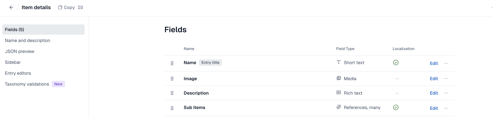

### Getting Started

```bash
Note: Header and Footer is added as a dummy html code. For any contentful project all contents should comes from contentful.

This code support translated content from contentful (currently en and fr are supported).

To translate text like error message we have used NEXT-INTL, Due to server render issue we removed its context provider code for now. Rest NEXT-INTL installations are kept as it is

You will see 3 images in the root image-1.png, image-2.png, image-3.png. Its the part of this read me file.
```

### First, run the development server:

Node version : v22.11.0
```bash
yarn


//To view the contentful pages, before running the below commands (for the first time) we need to add the page content model in contentful. You can see the steps under Contentful heading.

yarn codegen:contentful

yarn dev
```

### .env

```bash

NEXT_PUBLIC_BASE_URL="http://localhost:3000"
CONTENTFUL_SPACE_ID=""
CONTENTFUL_CONTENT_DELIVERY_TOKEN=""
CONTENTFUL_ENVIRONMENT=""
CONTENTFUL_CONTENT_MANAGEMENT_TOKEN=""
CONTENTFUL_CONTENT_PREVIEW_TOKEN=""
```

### Contentful

1: Create Page content type like the below.


2: Create Item Details content type, its a sample content type we used to display on our demo code. Keep the same text when you create content type


3: Go to content tab and add entry for home, inside home you can add item content module and hero module as Item details. You can use Add content button (at the bottom) inside home entry.


Once you add this you can run the [yarn dev] command and you will see the output on screen.

### CODE Flow

Here everything is driven from contentful. Based on page content type it will render

1: page.tsx, Path : app > [locale] > [slug]

2: module-renderer.tsx, Path: ui/utils/contentful/module-renderer.tsx

### To render new content type on screen

Once you create a new content type. Go to the code base and do the below steps.

1: Go to "ui/utils/contentful/core-module-registry.ts"

2: Add you newly created content type name. Then create a react module in "ui/modules" folder

### Content model types.

Content model types are auto generated using "CODEGEN", you can see details in package.json. This will run on build command. Incase you want to run before you can use

```bash
yarn codegen:contentful
```

Auto generated types will be availabe in "types/contentful/generated" folder
